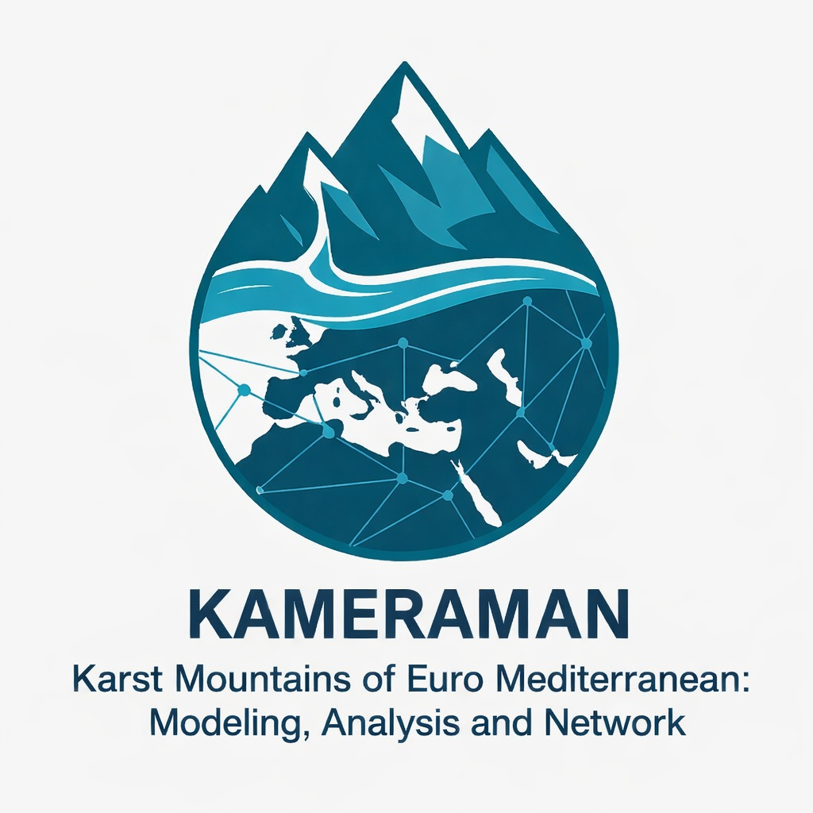

  

# KaMERaMAN-Dataset
KaMERaMAN includes karst spring discharge dataset from the mountain regions surrounding Euro-Mediterranean region.

General Information Dataset Title: Karst Mountains of Euro Mediterranean: Modeling, Analysis, and Network.

Principal Investigator: Süleyman Selim Çallı

Affiliation: Ankara University, Department of Geological Engineering, Ankara, Türkiye

Contact Information: scalli@ankara.edu.tr

Date of Data Publication: 1 April 2026

DOI: 

How to cite this dataset:
[Your Name(s)], (2026). High-Resolution Karst Spring Discharge Datasets of the Euro-Mediterranean Mountain Regions. Zenodo. https://doi.org/10.5281/zenodo.19448791

Related Publication (Preprint):
[Your Name(s)], (2026). [Manuscript Title]. Earth Syst. Sci. Data Discuss. [in review]. https://doi.org/[Your-Preprint-DOI]

1. License Information

This dataset is a compilation and harmonization of multiple public data sources.
* Direct download of the public data from national hydrometeorological institutions,
* Digitization of the published theses, reports, and discharge annuals,
* Directly shared data by the colleagues.

This aggregate dataset is licensed under Creative Commons Attribution-NonCommercial 4.0 International (CC BY-NC 4.0).

Reason for License Choice: This license was selected to comply with the restrictive requirements of the constituent data sourced from Austria (licensed under CC BY-NC), which prohibits commercial redistribution.

Usage Constraints: Users are free to share and adapt this material for non-commercial purposes, provided appropriate credit is given to the authors and the original data providers cited herein.

2. Data Sources & Citations

All raw data used to generate this dataset are publicly available. 
Detailed citations for each regional source (Alps, Atlas, Taurus, Zagros, etc.) are provided in the accompanying manuscript.

Original License Austria "ehyd.gv.at" / CC BY-NC 4.0 

All Other Regions Public Domain / CC BY 4.0 (or equivalent public license)

3. File Overview
Kameraman_metadata.csv: Contains site-specific information as below:

Region	Country	#ID	Spring Name	Literature	Lat/Lon/Elev(m)	Recharge Area(km2)	Start/End Date	Resolution	Source License	Contact

Alps	Austria	Aubachquelle	Cinkus et al.(2023)	47.36/10.172/1078	NA	1.1.1999/31.12.2022	Daily	ehyd.gv.at	CC BY NC 4.0	Simon Seelig, Jutta Eybl
		...		...

Hydrograph data: The hydrograph data folder includes 118 discharge time series which are named according to:

[3-digit Region code]_[ID Number 01-99]_[2-digit Country ISO code]@Spring name.csv

Each csv file includes metadata information as comment lines: (e.g. spring name / lat lon / start-end dates / available literature / license / contact person)

#-------------------------------------------------------
Examples: 

# Alps region (incl. 50 karst springs):
ALP_01_AT@Aubachquelle.csv
ALP_02_AT@Blaue_Quelle.csv
...
ALP_50_DE@Bergmannsquelle.csv

#-------------------------------------------------------
# Apennines (incl. 8 karst springs):
APE_01_IT@Castelsantangelo.csv
...
APE_08_IT@Bagnara.csv

#------------------------------------------------------
# Atlas (incl. 2 karst springs):
ATL_01_DZ@Ain Youkous.csv
ATL_02_MA@Ras El Ma.csv

#--------------------------------------------------------
# Balkans (incl. 4 karst springs):
BAL_01_BG@Yazo.csv
...
BAL_04_BG@Mugla.csv

#-------------------------------------------------------
# Betics (incl. 4 karst springs):
BET_01_ES@Cueva del Gato.csv
...
BET_04_ES@Natividad.csv

#--------------------------------------------------------
# Carpathians (incl. 8 karst springs):
CAR_01_SK@Dolna Lehote Vrabec 2.csv
...
CAR_08_CZ@Punkva_Skalní Mlýn.csv

#---------------------------------------------------------
# Dinarides (incl. 11 karst springs):
DIN_01_BA@Vrelo Bosne.csv
...
DIN_11_HR@Vrbica Ricice.csv

#---------------------------------------------------------
# Hellenides (incl. 3 karst springs):
HEL_01_GR@Almyros.csv
...
HEL_03_AL@Selita.csv

#---------------------------------------------------------
# Jura Mountains (incl 4 karst springs):
JUR_01_FR@Doubs.csv
...
JUR_04_FR@Verneau.csv

#---------------------------------------------------------
# Levant Mountains (incl 6 karst springs):
LEV_01_SY@Fageh.csv
...
LEV_06_LB@Qachqouch.csv

#---------------------------------------------------------
# Pyrenees (incl. 4 karst springs):
PYR_01_ES@Garces.csv
...
PYR_04_FR@Aliou.csv

#---------------------------------------------------------
# Taurus Mountains (incl. 6 karst springs):
TAU_01_TR@Kapuzbasi.csv
...
TAU_06_TR@Tacin.csv

#---------------------------------------------------------
# Zagros Mountains (incl 8 karst springs):
ZAG_01_IR@Barme-Jamal.csv
...
ZAG_08_IQ@Sarchawi Saraw.csv

#-----------------------------------------------------------

4. Data Processing & Harmonization

The data has been processed from various raw formats into a standardized, machine-readable structure suitable for hydrological modeling and machine learning applications (e.g., LSTM/CNN architectures).

Temporal Resolution: The majority of the dataset consisting of daily discharge data. In Atlas and Zagros regions, monthly data is also provided, where daily discharge data is scarce.

Unit Standardization: The discharge data are available in native format of the data provider (l/s and m3/s). 

Quality Control: Quality control is made by the regional experts (mentioned inside the manuscript). Gaps are not filled by artificial data.
		

5. Usage Notes

For those intending to use this data for academic research:
Please cite the primary Scientific Data paper associated with this DOI.

If your research focuses exclusively on a specific sub-region, we encourage you to also cite the original regional data provider listed in Section 2.

Non-Commercial Clause: Ensure your application of this data does not constitute commercial use, as per the CC BY-NC 4.0 agreement.

For further questions, please contact to Süleyman Selim Çallı: scalli@ankara.edu.tr

6. Full Collaborator List and Affiliations:

1Süleyman Selim Çallı, 2Brahim Akdim, 3Bruno Arfib, 4Aleksey Benderev, 5Sandra Beranger, 6Avi Burg, 1,7Onur Can, 8,9Jean-Baptiste Charlier, 1Mehmet Çelik, 1,7Arda Melih Çetin, 10Miroslava Deliyska, 11Lucio Di Matteo, 12Marco Dionigi, 13Romeo Eftimi, 14Jutta Eybl,  15Chemseddine Fehdi,  16Davide Fronzi, 17Nico Goldscheider, 18 Ergin Gökkaya, 19Jorge Jódar, 20Hervé Jourde, 21Eva Kaminsky, 22 Konstantina Katsanou, 23Alireza Kavousi, 7,24Melike Kaya, 25David Labat, 17Tanja Liesch, 26Peter Malik, 12Christian Massari, 27,28Cyril Mayaud, 29Naomi Mazzilli, 30Kübra Özdemir Çallı, 31Pavel Pracný, 27,28Nataša Ravbar, 3,32Nathan Rispal, 33Simon Seelig, 20Vianney Sivelle, 34Marc Steinmann, 11Daniela Valigi, 33Gerfried Winkler,  7Ahmet Kemal Yahşi, 30Andreas Hartmann

1 Ankara University Faculty of Engineering, Geological Engineering Department, 06830, Ankara, Türkiye

2 Université Privée de Fez, Fez, Morocco.

3 Aix Marseille Univ., CNRS, IRD, INRAE, CEREGE, Aix-en-Provence, France.

4 Geological Institute, Bulgarian Academy of Sciences, Acad. G. Bonchev Str., bl.24, 1113, Sofia, Bulgaria

5 Bureau de Recherches Géologiques et Minières-Délégation Régionale Occitanie-Sitede Toulouse, 31520 Ramonville-Saint-Agne, France

6 Geological Survey of Israel, Jerusalem, Israel

7 Ankara University Karst Research Community UNIKARST, 06830, Ankara, Türkiye

8 BRGM, Univ. Montpellier, Montpellier, France

9 G-EAU, Univ Montpellier, AgroParisTech, BRGM, CIRAD, INRAE, Institut Agro, IRD, Montpellier, France

10 Climate, Atmosphere and Water Research Institute, Bulgarian Academy of Sciences, . Tsarigradsko shose Bld. 66, 1784 Sofia, Bulgaria

11 University of Perugia, Department of Physics and Geology, Via Pascoli snc, 06123, Perugia, Italy.

12 Research Institute for Geo-hydrological Protection (IRPI), National Research Council (CNR), Perugia, Italy.

13 Independent Researcher, Tirana, Albania

14 Federal Ministry of Agriculture and Forestry, Climate and Environmental Protection, Regions and Water Management, Marxergasse 2, 1030 Vienna, Austria

15 University of Tebessa, Department of Earth Sciences and Univers , 12002, Tebessa, Algeria.

16 Università Politecnica delle Marche, Department of Materials, Environmental Sciences and Urban Planning, Via Brecce Bianche 12, 60131, Ancona, Italy

17 Karlsruhe Institute of Technology (KIT), Institute of Applied Geosciences, 76131 Karlsruhe, Germany

18 Department of Geography, Niğde Ömer Halisdemir University, 51240 Niğde, Türkiye

19 Geological Survey of Spain - Spanish Research Council  (IGME-CSIC), Zaragoza, Spain

20 Hydrosciences Montpellier (HSM), University of Montpellier, CNRS, IRD, Montpellier, France

21 Karst and Cave Group, Geological Paleontological Department, Natural History Museum, Vienna, Austria

22 Department of Water Resources and Ecosystems, IHE Delft Institute for Water Education, Delft, The Netherlands

23 State Authority for Mining, Energy, and Geology in Lower Saxony (LBEG), 30655, Hannover, Germany

24 Ankara University Faculty of Engineering, Computer Engineering Department, 06830, Ankara, Türkiye

25 University of Toulouse - Lab Geosciences Environnement Toulouse UMR CNRS-IRD-UT-CNES 14 Avenue Edouard Belin 31400 Toulouse

26 Štátny geologický ústav Dionýza Štúra – Geological Survey of Slovak Republic, Mlynská dolina 1, 817 04 Bratislava 11, Slovakia

27 ZRC SAZU Karst Research Institute, Titov trg 2, 6230 Postojna, Slovenia. 

28 UNESCO Chair on Karst Education, University of Nova Gorica, Glavni trg 8, 5271 Vipava, Slovenia

29 UMR 1114 EMMAH (AU-INRAE), Université d’Avignon, Avignon 84000, France

30 Institute of Groundwater Management, TUD Dresden University of Technology, Dresden, Germany

31 Masaryk University Department of Geological Sciences, Brno, Czechia

32 Univ. Côte d'Azur, Polytech'Lab- UPR 7498, Sophia- Antipolis, France

33 Department of Earth Sciences, NAWI Graz Geocenter, University of Graz, Heinrichstraße 26, 8010 Graz, Austria

34 University Marie and Louis Pasteur, Chrono-environnement, UMR CNRS 6249, 25000 Besançon, France

